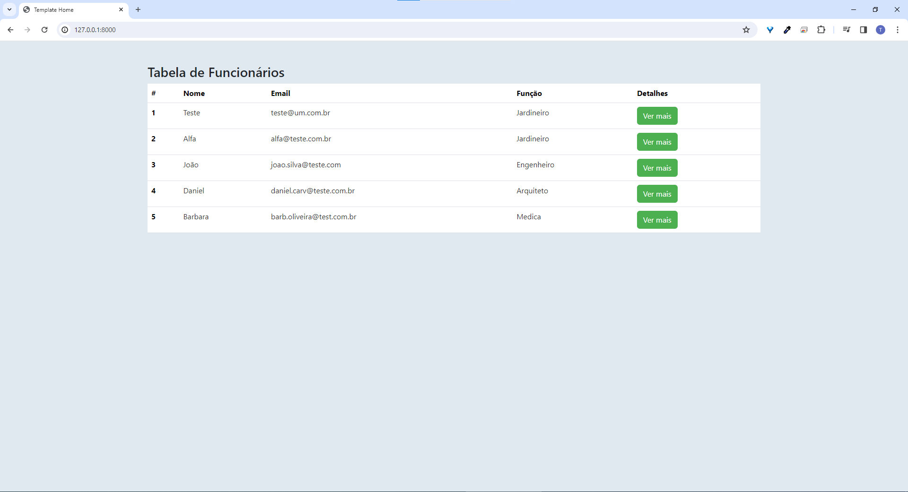
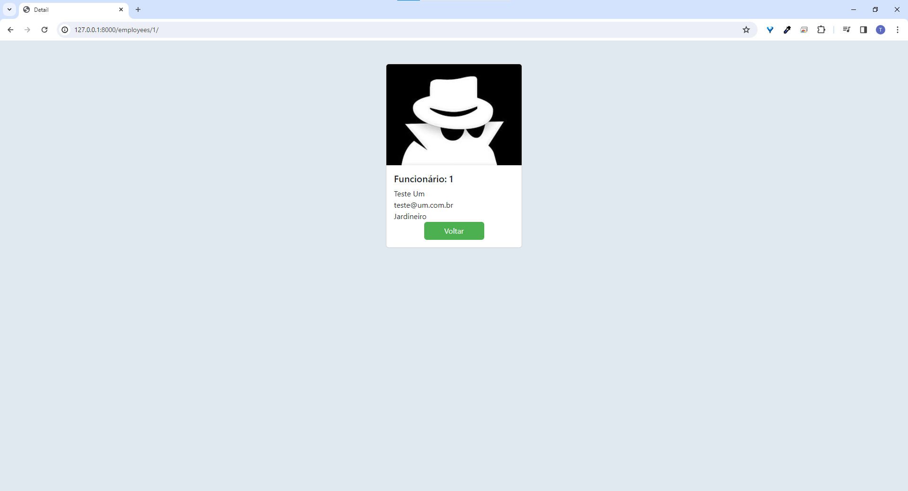

Primeira parte do Readme será em Português e a segunda em Inglês.
First part of the Readme will be in Portuguese and the second in English.

Criação de app utilizando Django e Python

O projeto consiste em um app principal para criação de uma tabela personalizada com botão para detalhes individuais de cada elemento.

Primeira tela:
Tela home, aqui é feita a mostra da tabela e de seus conteudos.

Segunda tela:
Tela de detalhes, aqui é possivel observar detalhadamente os dados de cada funcionario.

App creation using Django and Python

The project consists of a main app for creating a personalized table with a button for individual details of each element.

First screen:
Home screen, here the table and its contents are displayed.

Second screen:
Details screen, here it is possible to observe the data of each employee in detail.

